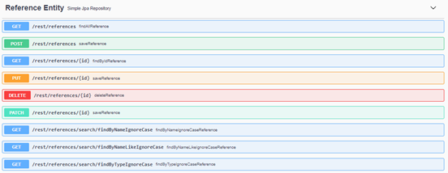
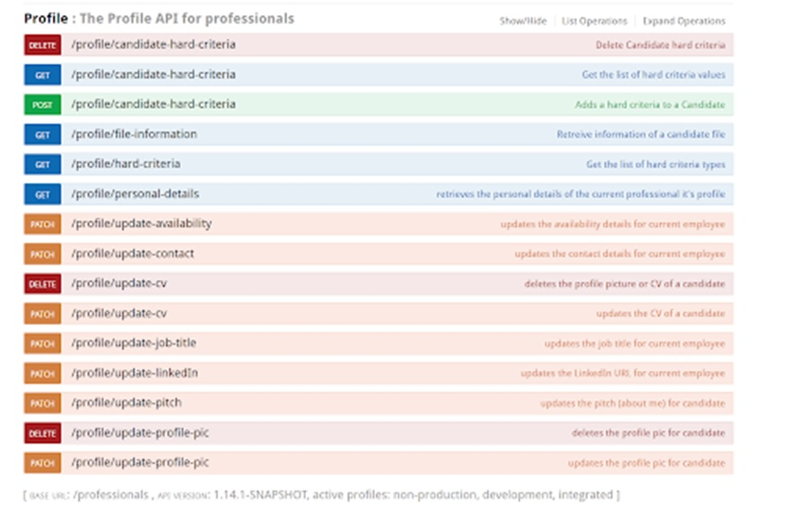

# ShowCase on how to LOW code 
* JAVA/SPRING 2 plus
* QueryDSL
* Spring Projections 

## Conclusion
Code was reduced by 80% and the implementation time at controller & repository level was cut just a third.
Projections took same amount of time as DTO's but no unit tested where need. So overall it was a great experience.
I learned more about REST end-point format, Swagger Testing & FE Model and Service generation. I will probably never
code an API service by hand on the FE side again.

### Per Item Benefits
* Spring Data Rest really can be used to lower your code base dramatically. Creating a full CRUD API with just one Repository interface with some annotations.
* Spring Projections allow you to decouple your ORM domain model from your API model like DTO's. "But using interfaces".
* Using QueryDSL made the implementation more adaptable at repository level. Cutting implementation time 6 fold. No unit tests needed just E2E.

## REST as close to spec as possible: 

## Json/SOAP certainly not REST :
