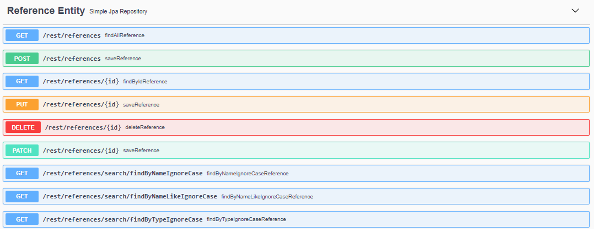

# ShowCase of Rest Perfect implementaitoion.
* JAVA/SPRING 2 plus
* QueryDSL
* Spring Projections 

## Conclusion
I learned a lot more about REST during this showcase then expected. Additionally, I will probably never code an API service and Models by hand on the SPA FE side again.
Further more BE Code was reduced by 80% and the implementation time at controller & repository level was cut to just a third.
Projections took the same amount of time as DTO's, but no unit tested where need. So adaptation is easier than with DTO's. Overall it liked this stack. And found it a great experience.

### Per Item Benefits
* Spring Data Rest really can be used to lower your code base dramatically. Creating a full CRUD API with just one Repository interface with some annotations.
* Spring Projections allow you to decouple your ORM domain model from your API model like DTO's. "But using interfaces".
* Using QueryDSL made the implementation more adaptable at repository level. Cutting implementation time 6 fold. No unit tests needed just E2E.

## Method to get to a REST Implementation close to theoretical specpossible: 
Is a rest Endpoint always an interpretation of the developer or can we generated it fully.
Using SpringData Rest 'which millions of developers use' and might contain the true spec in a practical example as we can get.
This project showcases that we can.
Thus leaving out any personal feelings on how to do it if done manually.
Which results in Swagger API based on below repository code. Which gets translated through to API version.

RESULTING:
in one line of code needed in the repository interface to create an matching API endpoint.
Enjoy. ;)



### Further Rest Perfect Generated Spring Endpoints included.
```
@CrossOrigin
@RepositoryRestResource(collectionResourceRel = "references", path = "references")
public interface ReferencesRepository extends CrudRepository<Reference, Long> {

    List<Reference> findByNameIgnoreCase(@Param("name") String name);
    List<Reference> findByTypeIgnoreCase(@Param("type") String type);
    List<Reference> findByNameLikeIgnoreCase(@Param("name") String name);

}
```

* GET/PUT/PATCH/POST/DELETE /rest/users/projects/*** based on below.
```
@CrossOrigin
@RepositoryRestResource(collectionResourceRel = "projects", path = "projects", excerptProjection = PProject.class)
public interface ProjectRepository extends CrudRepository<Project, Long> {

    List<Project> findByNameIgnoreCase(@Param("name") String name);
    List<Project> findByNameLikeIgnoreCase(@Param("name") String name);

    List<Project> findByUser_NameLikeIgnoreCase(@Param("userName") String userName);

    List<Project> findByUser_Id(@Param("userId")Long id);
    List<Project> findByUser_Name(@Param("userName") String name);

    List<Project> findByNameLikeIgnoreCaseOrUser_NameLikeIgnoreCase(@Param("name") String name, @Param("userName") String userName);

    List<Project> findByNameIgnoreCaseAndUser_NameIgnoreCase(@Param("name") String name, @Param("userName") String userName);
    long countByNameIgnoreCaseAndUser_NameIgnoreCase(@Param("name") String name, @Param("userName") String userName);

    @RestResource(exported = false)
    @Transactional
    @Modifying
    @Query("UPDATE Project e set e.deleted=1 where e.id = ?1")
    void deleteCustom(Long projectId);

}

```

* GET/PUT/PATCH/POST/DELETE /users/*** based on below.
```
@CrossOrigin
@RepositoryRestResource(collectionResourceRel = "users", path = "users", excerptProjection = PUser.class)
public interface UserRepository extends CrudRepository<User, Long> {

    List<User> findByNameIgnoreCase(@Param("name") String name);
    long countByNameIgnoreCase(@Param("name") String name);
    List<User> findByNameLikeIgnoreCase(@Param("name") String name);
}

```

## Json/SOAP certainly not REST :
